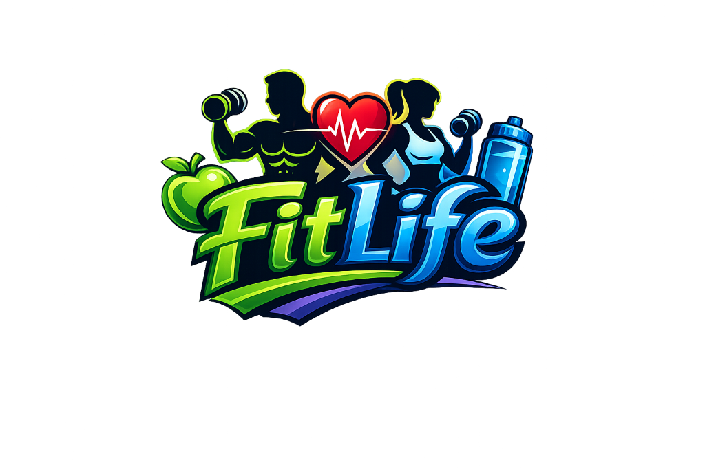

# 🏋️ FitLife Pro

**Your personalized fitness and nutrition companion** - Get custom workout plans and diet plans tailored to your goals, fitness level, and dietary preferences.



---

## ✨ Features

### 📊 Systematic Plan Generation
- **572 Pre-Designed Plans** - Scientifically crafted combinations
- **312 Workout Plans** - Based on BMI, location, fitness level, and goals
- **260 Diet Plans** - Customized for BMI, goals, and dietary restrictions

### 🏋️ Workout Plans
- **13 BMI Levels** (16-40) for precise personalization
- **2 Locations**: Home workouts or Gym routines
- **3 Fitness Levels**: Beginner, Intermediate, Advanced
- **4 Goals**: Weight Loss, Weight Gain, Endurance, Muscle Gain
- **5-Day Training Splits** with detailed exercises

### 🥗 Diet Plans
- **6-Meal Structure**: Breakfast, Snacks, Lunch, Dinner
- **5 Diet Types**:
  - Standard (Balanced)
  - Vegetarian
  - Vegan
  - Gluten-Free
  - Dairy-Free
- **Goal-Specific Macros**: Optimized for your fitness objectives
- **Calorie Scaling**: Automatically adjusted based on BMI

### 🎯 User Features
- **Save Plans** - Store your favorite workout and diet plans
- **Workout Timer** - Built-in timer for exercises
- **Progress Analytics** - Track your fitness journey
- **Workout Templates** - Pre-made routines for quick starts
- **Feedback System** - Share your experience

### 🔐 Authentication
- **Secure Login/Signup** - JWT-based authentication
- **Email Verification** - Verify your account via email
- **Password Reset** - Secure password recovery
- **Protected Routes** - Secure user data

---

## 🚀 Tech Stack

### Frontend
- **React** - UI library
- **Tailwind CSS** - Styling
- **Lucide React** - Icons
- **React Router** - Navigation (SPA)

### Backend
- **Node.js** - Runtime
- **Express** - Web framework
- **MongoDB** - Database
- **Mongoose** - ODM
- **JWT** - Authentication
- **Brevo** - Email service

---

## 🎯 User Workflow

### 1. **Sign Up / Login**
   - Create account with email verification
   - Or login with existing credentials

### 2. **Generate Personalized Plan**
   - Enter your details (age, weight, height, gender)
   - Choose your goal (Weight Loss, Muscle Gain, etc.)
   - Select fitness level and location
   - Pick dietary preferences

### 3. **View Your Plan**
   - See workout schedule (5-day split)
   - View diet plan (6 meals per day)
   - Check calories and macros

### 4. **Save & Track**
   - Save plans to your account
   - Access saved plans anytime
   - Track progress with analytics

### 5. **Use Workout Features**
   - Start workout timer
   - Browse workout templates
   - Follow structured routines

---

## 📱 Pages & Routes

| Route | Description |
|-------|-------------|
| `/` | Home page with app overview |
| `/auth` | Login / Signup page |
| `/input` | User details input form |
| `/plan` | Generated workout & diet plan |
| `/saved` | Saved plans library |
| `/templates` | Pre-made workout templates |
| `/timer` | Workout timer |
| `/analytics` | Progress tracking |

---

## 🏗️ Project Structure

```
fitlife-pro/
├── public/              # Static assets
│   ├── assets/images/   # Images
│   ├── favicon.png      # App icon
│   └── index.html       # HTML template
├── src/
│   ├── components/      # React components
│   ├── contexts/        # Context providers
│   ├── services/        # API services
│   ├── plans.js         # Plan generation logic
│   └── App.js           # Main app component
├── backend/
│   ├── controllers/     # Request handlers
│   ├── models/          # MongoDB schemas
│   ├── routes/          # API routes
│   ├── middleware/      # Auth middleware
│   └── server.js        # Express server
└── package.json         # Dependencies
```

---

## 🎨 Performance Optimizations

- ✅ **Code Splitting** - Lazy loading for faster initial load
- ✅ **Image Optimization** - WebP conversion for 70-80% size reduction
- ✅ **Caching Strategy** - Long-term caching for static assets
- ✅ **Minification** - Optimized production builds
- ✅ **Back/Forward Cache** - Instant page navigation

**Target Lighthouse Score**: 75-85

---

## 🔒 Security Features

- JWT-based authentication
- Password hashing with bcrypt
- Email verification required
- Protected API routes
- Environment variable protection
- CORS configuration

---

## 📄 API Endpoints

### Authentication
- `POST /api/auth/register` - Create account
- `POST /api/auth/login` - User login
- `GET /api/auth/verify/:token` - Email verification

### Plans
- `POST /api/plans` - Save plan
- `GET /api/plans` - Get user's plans
- `DELETE /api/plans/:id` - Delete plan

### Feedback
- `POST /api/feedback` - Submit feedback


## 👨‍💻 Author

**Your Name**
- GitHub: [Mohit Jhawar](https://github.com/mohit-jhawar)

---

## 🙏 Acknowledgments

- Workout encyclopedia data
- Diet encyclopedia data
- React community
- MongoDB documentation

---

## 📞 Support

For support, email mohitjhawar1128@gmail.com or open an issue on GitHub.

---

**Made with ❤️ for fitness enthusiasts**
